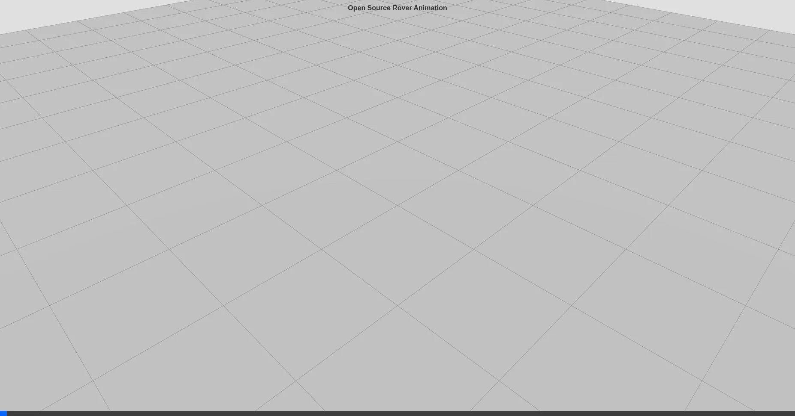

# Rover ROS 2 Workspace




ROS 2 workspace for mecanum base control and lift actuation. Integrates CAN-bus hardware interfaces, kinematic velocity smoothing, and web-based teleoperation.

---

## 📦 Workspace Architecture

This workspace is modular and broken down into focused packages:

| Package | Description |
|---------|-------------|
| **[`rover_base`](rover_base/README.md)** | The core C++ hardware abstraction layer. Manages mecanum kinematics, velocity smoothing, fault detection, and CAN bus commands for the wheels and lifts. |
| **[`rover_msgs`](rover_msgs/README.md)** | Defines custom ROS 2 messages (`.msg`) and action servers (`.action`) specifically tailored for the rover's actuators. |
| **[`rover_bringup`](rover_bringup/README.md)** | The main entry point. Contains the consolidated launch files required to start the entire system simultaneously. |
| **[`rover_description`](rover_description/README.md)** | Physical definitions, URDF, and visual meshes used by the robot state publisher and RViz. |
| **[`rover-dashboard`](rover-dashboard/README.md)** | A responsive HTML/JS web GUI connecting over WebSockets to provide remote telemetry and teleoperation control. |
| **[`rover_core`](rover_core/README.md)** | Metapackage containing high-level orchestrations and top-level launch sequences. |

---

## 🛠️ Building the Workspace

### Prerequisites
- **Ubuntu 24.04** (Recommended)
- **ROS 2 Jazzy**

### Dependencies
Ensure you have the necessary ROS 2 development tools and bridge suites:
```bash
sudo apt update
sudo apt install python3-colcon-common-extensions ros-jazzy-rosbridge-server ros-jazzy-ros2-socketcan
```

### Compilation
Clone this repository into your local ROS 2 workspace (e.g., `~/rover_ws/src`) and build using `colcon`:
```bash
cd ~/rover_ws
colcon build --symlink-install
```

---

## 🚀 Running the System

Once built, source the workspace overlay:
```bash
source install/setup.bash
```

To bring up the entire hardware stack (ensure your CAN bus, e.g. `can0`, is active):
```bash
ros2 launch rover_bringup bringup.launch.py
```

To launch the visualization tool (RViz) without hardware:
```bash
ros2 launch rover_description display_rover.launch.py
```

---

## 🤝 Contributing
Contributions are welcome! If you would like to improve the kinematics engine, write additional test suites, or migrate the `rover_base` hardware abstraction to `ros2_control` plugins, please open an Issue or submit a Pull Request.

## 📄 License
This project is open-source and licensed under the [Apache License 2.0](LICENSE).
